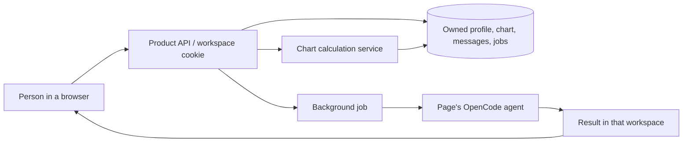

# Iktara's product world

Iktara is a product world with places to act, personal context, and agents that respond within those places. The UI is one way to enter that world. The runtime owns work and results even when a browser is waiting or reconnecting.

## Current world

| Place      | Human intention                                        | Agent responsibility                                  | Service/data boundary                      |
| ---------- | ------------------------------------------------------ | ----------------------------------------------------- | ------------------------------------------ |
| Reflection | Think through a feeling, need, relationship, or choice | Warm, grounded conversation; preserve personal agency | Own workspace's profile and conversation   |
| Chart      | Explore birth-chart symbolism                          | Explain supplied calculations; identify uncertainty   | Own computed chart from the Python service |

The registered page/agent IDs and prompts live in `apps/local/server/worlds.ts` and `prompts.ts`; the OpenCode plugin installs them. A browser can select only a known page. It cannot supply a different agent, model, workspace owner, arbitrary tool, or system prompt.

## Identity and memory

The current no-signup identity is a random HttpOnly browser cookie. All data and job lookups are scoped by its server-resolved owner. This separates browser workspaces; it does not prove a human identity or provide account recovery across devices. Clearing cookies loses access to that workspace. Account linking or recovery must be designed explicitly before claiming otherwise.

Background jobs persist in the product database. Queued work can resume after restart. Work interrupted during inference is marked failed so the person can retry; the runtime does not silently repeat a potentially billed model request. Responses are written back to the requesting workspace. Product storage and deployment state stay outside immutable release directories.

OpenCode sessions are short-lived execution contexts under the owning workspace, while the product database holds durable user-visible history. No coding tools or personal MCP integrations are exposed to these agents. A new service should declare its input, output, owner check, and permitted effects before a page agent can call it.

## Codex, OpenCode server, and ACP

Codex and OpenCode are also tools the team uses to build this world. Their coding sessions belong to contributors and follow AGENTS.md and the shared contributor prompt. They must not inherit customer sessions or the production key.

The product uses OpenCode's embedded v2 runtime behind its own API. ACP is a protocol for connecting a coding agent to an editor/client; it is not a replacement for the product's user authorization or data store. An editor can use its OpenCode ACP integration to contribute to the repository. This implementation does not expose a public ACP endpoint or a general-purpose coding-agent server to customers.

## Add a place

Define its human purpose, page ID, agent prompt, allowed services, stored data, and result presentation together. Register it in the world configuration, add a matching `.opencode/agents/product/<agent>.md` spec mirror (see `docs/RUNTIME.md`), then test that its context belongs to the current workspace and that another workspace cannot fetch its jobs or results. Ship page and prompt changes through the same reviewed CI/CD process.
